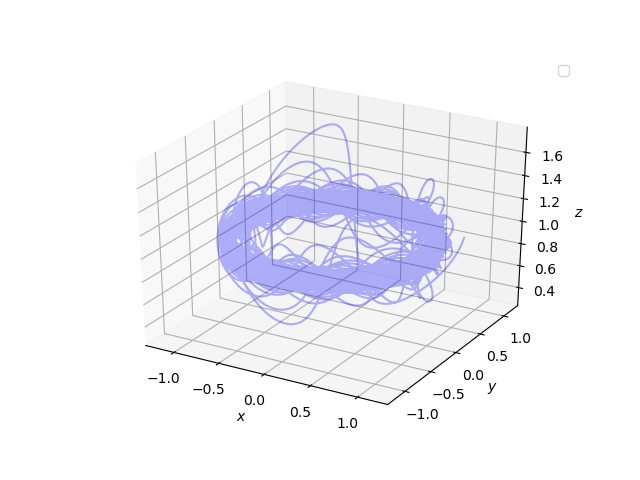

# multiflap

`multiflap` is a Python toolbox for finding periodic orbit of nonlinear systems
of ODEs. The code relies on the multiple-shooting algorithm, and simoultaneously allows to study the stability of the system via the Floquet multipliers.

This toolbox is optimised to study the limit cycle of flapping wings dynamics, but the modular architecture allows the user to use the kernel with any set of ODEs.

In order to run the code for a particular dynamical system, two files have to be created:
* **Input file**: The input file contains the system of differential equations, and the related staility matrix.
* **Main file**: The main file is the python module that will e executed. More detailes on the format of the main file will be provided later. **NOTE** despite of example cases, the main file has to be inside `multiflap` directory.
## Installation and getting started

`multiflap` runs on Python 3 and Python 2.  

1.   Get a local copy of `multiflap`:

```
git clone git@git.immc.ucl.ac.be:gducci/multishooting_flapping.git 
```
2. Add multiflap to the PYTHONPATH environment variable (`pwd` to get the path you need)

```bash
export PYTHONPATH=my/path/from/root/to/folder:$PYTHONPATH
```
3. To run one of the examples, from the multiflap root directory:

```
python3 examples/rossler_system.py
```
## Input files

The input file is the file containing the set of ODEs, and saved within the directory
```
multiflap/odes
```

Examples of input file can be found [here](multiflap/odes).
The name of the class is arbitrary, while the names of the methods (`dynamics` and `get_stability_matrix`) cannot be changed because this is the interface that communicates with the multiple-shooting kernel. If the stability matrix of the system is hard to hand-code, the user can run the code by setting the numerical computation from the aguments of `MultipleShooting` or `MultipleShootingPeriod` classes, as shown in the [example](examples/lorentz_system.py).

## Main file

Two different classes should be called, depending if the period of the periodic orbit is known or not a priori.

#### Unknown period

For periodic orbits with unknown periods, the code relies on the modules `multiple_shooting_period.py` and `lma_solver_period.py`.

1. Import the model module `your_model.py`, and the other modules needed to run and solve the multiple shooting problem. Then create the model object. The model is created by calling the Class previously defined within [odes](multiflap/odes) directory.

```python
from odes.your_model import YourOdeClass
from ms_package.multiple_shooting_period import MultipleShootingPeriod
from ms_package.lma_solver_period import SolverPeriod
your_model = YourOdeClass() 	# takes eventual arguments (parameters) if needed
```
2. Call the multiple-shooting scheme. It take as arguments:

* **x**: state space points guess
* **M**: int, number of multiple-shooting points
* **period_guess**: first guess of the periodic orbit period
* **t_steps**: time steps from two consecutive points
* **model**: ODE class
* **option_jacobian**: 'numerical' or 'analytical' (if not specified, analytical is the default)

```python
ms_obj = MultipleShootingPeriod(x, M=2, period_guess= 23.,
		t_steps=50000, model=your_model, option_jacobian = 'analytical')
```
3. Call the multiple-shooting solver.
```python
mysolution = SolverPeriod(ms_obj = ms_obj).lma()
```

#### Known period 


For periodic orbits with known periods, the code relies on the modules `multiple_shooting.py` and `lma_solver.py`.

1. Build the model object. The model is created by calling the Class previously defined within [odes](multiflap/odes) directory.

```python
from odes.your_model import YourOdeClass
from ms_package.multipleshooting import MultipleShooting
from ms_package.lma_solver import Solver
your_model = YourOdeClass()
```
2. Call the multiple-shooting scheme. It take as arguments:

* **x**: state space points guess
* **M**: int, number of multiple-shooting points
* **period**: periodic orbit period
* **t_steps**: time steps from two consecutive points
* **model**: ODE class
* **option_jacobian**: 'numerical' or 'analytical' (if not specified, analytical is the default)

```python
ms_obj = MultipleShooting(x, M=2, period= 0.25,
		t_steps=50, model=your_model, option_jacobian = 'analytical')
```
3. Call the multiple-shooting solver.
```python
mysolution = Solver(ms_obj = ms_obj).lma()
```

## Guided example to create a new study case
Within this tutorial, a new study case will be created and run. 

1. Generate the input file containing the ODEs, inside `multiflap/odes/isothermal_reaction.py`:

```python
import numpy as np

"""
Example case adopted from:

    Practical Bifurcation and Stability Analysis, page 325
    Seydel R.
    Eq. (7.15) - Isothermal chemical reaction dynamics


"""

class IsothermalReaction:
    def __init__(self, lam=1.8):
        self.lam = lam
        self.dimension=3        # specify the dimension of the problem
    def dynamics(self, x0, t):

        """ODE system
        This function will be passed to the numerical integrator

        Inputs:
            x0: initial values
            t: time

        Outputs:
            x_dot: velocity vector
        """
        y1, y2, y3 = x0
        dy1_dt = y1*(30 - 0.25*y1 -y2 -y3) + 0.001*y2**2 + 0.1
        dy2_dt = y2*(y1 - 0.001*y2 - self.lam) + 0.1
        dy3_dt = y3*(16.5 - y1 -0.5*y3) + 0.1

        vel_array = np.array([dy1_dt, dy2_dt, dy3_dt], float)
        return vel_array


    def get_stability_matrix(self, x0, t):

        """
        Stability matrix of the ODE system

        Inputs:
            x0: initial condition
        Outputs:
            A: Stability matrix evaluated at x0. (dxd) dimension
            A[i, j] = dv[i]/dx[j]
        """
        y1, y2, y3 = x0
        A_matrix = np.array([[30 - 0.5*y1 -y2 -y3, y1 + 2*0.001*y2, -y1],
                            [y2, y1 - 2*0.001*y2 -self.lam, 0.],
                            [-y3, 0., 16.5 - y1 - y3]], float)

        return A_matrix
```
2. Generate the main file to run in the directory `multiflap/main_isothermal.py`
```python
import numpy as np
from  odes.isothermal_reaction import IsothermalReaction
from ms_package.multiple_shooting_period import MultipleShootingPeriod
import matplotlib.pyplot as plt
from ms_package.lma_solver_period import SolverPeriod
from mpl_toolkits.mplot3d import Axes3D

# generate the ODEs object

mymodel = IsothermalReaction(lam=11.)


# initial condition
x = [40., 20., 20.]

# generate the multiple shooting object
ms_obj = MultipleShootingPeriod(x, M=20, period_guess=.5,
                                t_steps=200, model=mymodel)

# just to plot the initial guess distribution. No need to call this
initial_guess = ms_obj.get_initial_guess()

# call the solver for the multiple-shooting algorithm
mysolution = SolverPeriod(ms_obj=ms_obj).lma()

jacobian = mysolution[4]

# Floquet multipliers
eigenvalues, eigenvectors = np.linalg.eig(jacobian)

# ODE limit cycle solution
sol_array = mysolution[3].space
sol_time = mysolution[3].time
period = sol_time[-1]

# plot the phase portrait of the limit cycle
fig1 = plt.figure(1)
ax = fig1.gca(projection='3d')
ax.set_xlabel('$x$')
ax.set_ylabel('$y$')
ax.set_zlabel('$z$')
ax.scatter(initial_guess[:,0],
           initial_guess[:,1],
           initial_guess[:,2], color='red', label='initial guess')
ax.plot(sol_array[:, 0],
        sol_array[:, 1],
        sol_array[:, 2],color = 'b')
plt.legend()
plt.show()

```
3. Run the main file inside `multiflap` directory
```
python3 main_isothermal.py
```
the output will look like 


## Literature

#### Multiple shooting scheme 

Improved numerical Floquet multipliers \[[pdf](pdfs/lust2001.pdf)\]\
Lust, Kurt\
International Journal of Bifurcation and Chaos, vol. 11, pp. 2389--2410, 2001

ChaosBook, Chaos: Classical and Quantum \
P. Cvitanovi\'c, R. Artuso, R. Mainieri, G. Tanner and G. Vattay \
Niels Bohr Institute, Copenhagen 2016

#### Example cases and validation

###### Rossler's system \[[odes](multiflap/odes/rossler.py)\]
Optimized shooting method for finding periodic orbits of nonlinear dynamical systems \[[pdf](pdfs/dednam2015.pdf)\]\
Dednam, W and Botha, Andre E \
Engineering with Computers, vol. 31, num. 4, pp. 749--762, 2015, Springer

Contruction of Poincaré Return Maps for Rössler Flow \[[pdf](pdfs/basu2007.pdf)\] \
A. Basu \
Tech. Report, School of Engineering, Georgia Institute of Technology, 2007 

###### Redox oscillator \[[odes](multiflap/odes/redox_oscillation.py)\]
A Robust Model for Circadian Redox Oscillations \[[pdf](pdfs/delolmo2019.pdf)\]\
del Olmo, M.; Kramer, A.; Herzel, H.
*Int. J. Mol. Sci.*, **2019**, 20, 2368

###### Forced Van der Pol oscillator \[[odes](multiflap/odes/forced_vdp.py)\]
Practical Bifurcation and Stability Analysis, pp. 347--349 \ 
Seydel, R., 2009
