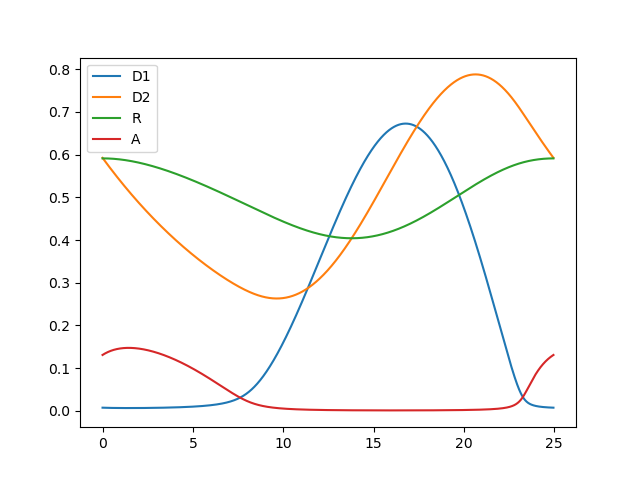

Redox oscillation
=================

The set of ODEs for this system is:

.. math::
  \frac{dD_{1}}{dt} &= p - aA D_{1} -d D_{1}\\
  \frac{dD_{2}}{dt} &= dD_{1} - eD_{2}\\
  \frac{dR}{dt} &= eD_{2} - qR\\
  \frac{dA}{dt} &= bIR - aAD_{1}

and the stability matrix:

.. math::
   
   \begin{equation}
   \mathbb{A}(\mathbf{x}(t), t) =
   \begin{pmatrix}
   -d -aA & 0 & 0 & -aD_{1}\\
   d & -e & 0 & 0\\
   0 & e & -q & 0\\
   -aA & 0 & b(1-a) & -bR -aD_{1}
   \end{pmatrix}
   \end{equation}


1. Generate the input file containing the ODE system and the hard code the stability matrix, inside ``multiflap/odes/redox_oscillation.py``::

        
        class RedoxModel:
            def __init__(self, a=1000, b=2, c=10000, d=0.2, e=0.1, q=0.1, p=1):

                self.a = a
                self.b = b
                self.c = c
                self.d = d
                self.e = e
                self.q = q
                self.p = p
                self.dimension = 4
            def dynamics(self, x0, t):

                """ODE system
                This function will be passed to the numerical integrator

                Inputs:
                    x0: initial values
                    t: time

                Outputs:
                    x_dot: velocity vector
                """
                D1, D2, R, A = x0
                dD1_dt = self.p - self.a*A*D1 - self.d*D1
                dD2_dt = self.d*D1 - self.e*D2
                dR_dt = self.e*D2 - self.q*R
                dA_dt = self.b*(1-A)*R - self.a*A*D1

                vel_array = np.array([dD1_dt, dD2_dt, dR_dt, dA_dt], float)
                return vel_array


            def get_stability_matrix(self, x0, t):

                """
                Stability matrix of the ODE system

                Inputs:
                    x0: initial condition
                Outputs:
                    A: Stability matrix evaluated at x0. (dxd) dimension
                    A[i, j] = dv[i]/dx[j]
                """
                D1, D2, R, A = x0
                A_matrix = np.array([[-self.d - self.a*A,  0., 0.,-self.a*D1],
                              [self.d,  -self.e, 0., 0.],
                              [0., self.e, -self.q, 0.],
                              [-self.a*A, 0., self.b*(1-A), -self.b*R -self.a*D1]], float)

                return A_matrix


2. Generate the main file to run in the directory ``multiflap/redox_main.py``:

Import the class generated in the input file ``RedoxModel`` and the modules to run and solve the multiple-shooting

.. code-block:: python

   from  odes.rossler import RedoxModel
   from ms_package.rk_integrator import rk4
   from ms_package.multiple_shooting_period import MultipleShootingPeriod
   from ms_package.lma_solver_period import SolverPeriod

set the initial guess:

.. code-block:: python
   
   x = [0.5, 0.5, 0.6, 0.2]

Generate the object containing the Rossler's equations:

.. code-block:: python

   mymodel = RedoxModel()

Passe the object to the multiple-shooting class, and solve it

.. code-block:: python

   ms_obj =  MultipleShootingPeriod(x, M=2, period_guess= 23., t_steps=50000, model=mymodel)
   mysol = SolverPeriod(ms_obj = ms_obj).lma()

.. toggle-header::
    :header: ```redox_main.py`` **Show full main**

            .. code-block:: python

                import numpy as np
                from  odes.redox_oscillation import RedoxModel
                from ms_package.rk_integrator import rk4
                from ms_package.multiple_shooting_period import MultipleShootingPeriod
                from scipy.integrate import odeint
                import matplotlib.pyplot as plt
                from ms_package.lma_solver_period import SolverPeriod

                x = [0.5, 0.5, 0.6, 0.2]

                time_array = np.linspace(0, 180, 90000)
                mymodel = RedoxModel()

                ms_obj =  MultipleShootingPeriod(x, M=2, period_guess= 23., t_steps=50000, model=mymodel)

                mysol = SolverPeriod(ms_obj = ms_obj).lma()

                jac = mysol[4]

                eigenvalues, eigenvectors = np.linalg.eig(jac)


                sol_array = mysol[3].space
                sol_time = mysol[3].time
                period = sol_time[-1]

                plt.plot( sol_time, sol_array[:,0], label = "D1")
                plt.plot( sol_time, sol_array[:,1], label = "D2")
                plt.plot( sol_time, sol_array[:,2], label = "R")
                plt.plot( sol_time, sol_array[:,3], label = "A")
                plt.legend()
                plt.show()

The solution is shown below:




and the value of the stable Floquet multipliers is also plotted:

.. figure:: ../../img/redox_multipliers.png
   :alt: Floquet multipliers.
   :align: center
   :width: 65%
